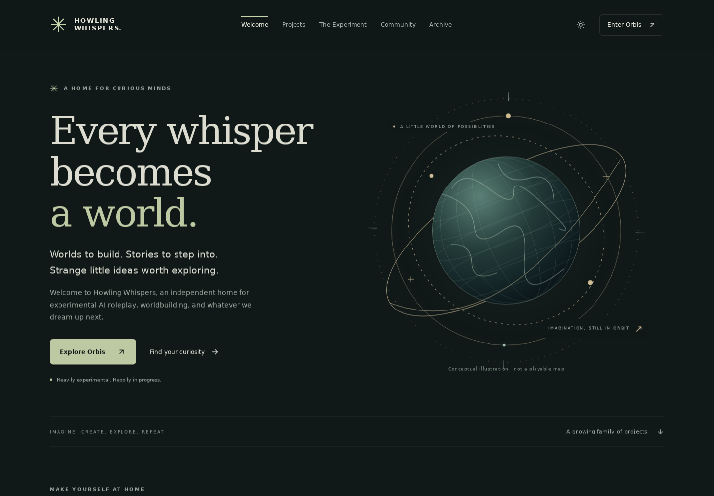
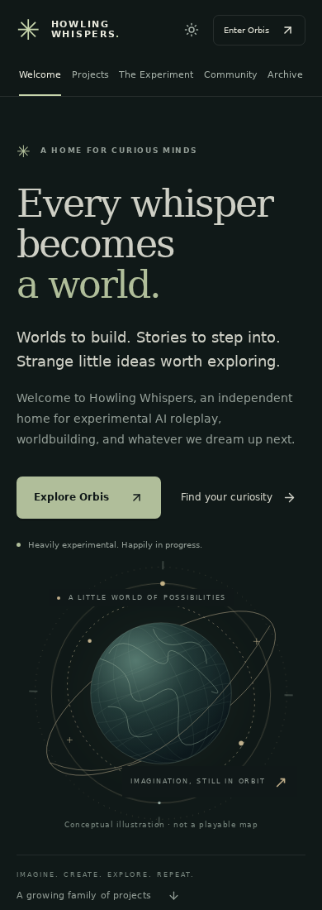

# Howling Whispers welcome hub

The hub welcomes visitors into an experimental family of projects. Its five hash-linked views are Welcome, Projects, The Experiment, Community, and Archive. A shared project catalog and category filters leave room for unrelated future projects.

## Experience

- Responsive forest, sage, and cream palette with a saved light/dark preference.
- Lightweight SVG world illustration. It is conceptual artwork, not a playable map.
- Gentle transitions, visible keyboard focus, a skip link, touch-sized controls, and a reduced-motion alternative.
- Orbis is the public starting point. Speculus opens through the world's Simulate action in Orbis.
- Fabula and Studium remain explicitly in development. Mouseion is a planned creation layer; the EVE utility is private and in development.
- Interactive Orbis → Speculus → Fabula → Studium cycle, with human review before discoveries return to Orbis.
- Existing section hashes are supported as aliases. Navigation supports browser history and direct links.
- Updated metadata, static fallback, favicon, and PNG social preview.

## Validation

Production TypeScript/Vite build passed. Headless Chromium checked all five views at 320, 390, 768, and 1440 pixels with no document overflow or runtime errors. Verified project filtering, cycle selection, theme persistence after reload, reduced-motion behavior, and legacy deep links. Desktop, phone, light theme, and cycle screenshots were visually inspected. An overflowing illustration caption and crowded mobile cycle label were fixed during inspection.

Validation was local. External services and the production server were not deployment-tested. Google Fonts is optional; system fonts provide a fallback.

## Preview

